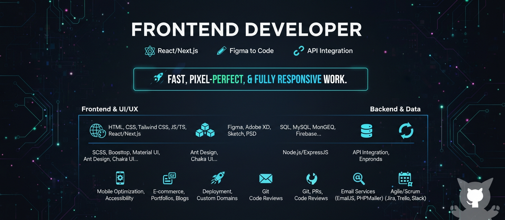

<h1 align="center">Hi, I'm Nikita 👋</h1>
<h3 align="center">I turn complex designs into pixel-perfect, high-performance websites.</h3>

  <b>Frontend Developer | Next.js, React & Modern UI Specialist</b> 
  I don't just write code; I partner with you to turn your ideas into software that feels clear, responsive, and robust.
   
   
  
  

---

### 🚀 What I Bring to the Table

I specialize in building accessible, lightning-fast applications with a focus on polished UI/UX.

- **Pixel-Perfect Frontend:** Expert at translating Figma, Adobe XD, and Sketch designs into fully responsive code using **React, Next.js, and TypeScript**.
- **Modern Styling:** Mastery of **Tailwind CSS, SCSS, Framer Motion**, and component libraries like shadcn/ui.
- **Full-Stack Capable:** Comfortable building robust backends with **Node.js, Express, Python, and PHP**.
- **Data & APIs:** Experience managing **PostgreSQL, MongoDB, Firebase, and Supabase**.
- **Performance First:** I prioritize Core Web Vitals, SEO, and accessibility in every project.

---

### 💼 Freelancing & Collaboration

I have **6+ years of experience** delivering production-ready applications for startups and businesses.

- 🌍 Top Rated Freelancer on [**Upwork**](https://www.upwork.com/freelancers/~01666af90b1c137ab9)
- 🤝 Open to contract work and long-term collaborations
- 💬 Agile/Scrum experienced (Jira, Linear, Slack, Git)

**Have a project idea?** [Let's chat!](mailto:yeldynovn@gmail.com)

---

### 🛠️ Languages & Tools

**Frontend Frameworks & Libraries**

  
  
  
  
  
  
  
  

**Styling, UI & Animation**

  
  
  
  
  
  
  
  

**Backend & Database**

  
  
  
  
  
  
  
  
  

**Tools, Design & DevOps**

  
  
  
  
  
  
  
  

---

### 📌 Connect with Me

- 💼 [Upwork Profile](https://www.upwork.com/freelancers/~01666af90b1c137ab9)
- 👨‍💻 [GitHub Projects](https://github.com/yeldynov)
- 🧪 [Frontend Mentor](https://www.frontendmentor.io/profile/yeldynov)
- 🧠 [Codewars](https://www.codewars.com/users/yeldynov%20/)

 

  

