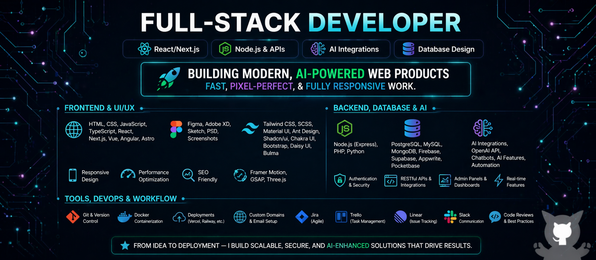

<h1 align="center">Hi, I'm Nikita 👋</h1>
<h3 align="center">I build high-quality web products — from UI to database to AI integrations.</h3>

  <b>Full-Stack Developer | Next.js, React, Node.js & AI Integrations</b> 
  I don’t just write code; I design and build systems that are fast, scalable, and feel great to use.
    
  
  

---

### 🚀 What I Bring to the Table

I specialize in building modern web applications that combine polished UI, solid backend architecture, and AI-powered features.

- **Pixel-Perfect Frontend:** Turning Figma, Adobe XD, and Sketch designs into responsive interfaces using **React, Next.js, and TypeScript**.
- **Full-Stack Ownership:** APIs, authentication, admin panels, integrations, and backend logic with **Node.js, Express, Python, and PHP**.
- **AI Integrations:** Chatbots, content generation, smart search, automation, and custom AI workflows using modern AI APIs.
- **Data & Architecture:** Experience with **PostgreSQL, MongoDB, Firebase, Supabase**, and clean database design.
- **Modern UI & Motion:** **Tailwind CSS, SCSS, Framer Motion, shadcn/ui** for premium UI/UX.
- **Performance First:** Core Web Vitals, SEO, accessibility, and scalability are always priorities.

---

### 💼 Freelancing & Collaboration

I have **6+ years of experience** delivering production-ready applications for startups and businesses.

- 🌍 Top Rated Freelancer on [**Upwork**](https://www.upwork.com/freelancers/~01666af90b1c137ab9)
- 🤝 Open to contract work and long-term collaborations
- 💬 Agile/Scrum workflow (Jira, Linear, Slack, Git, Docker)

**Have a project idea?** [Let’s chat!](mailto:yeldynovn@gmail.com)

---

### 🛠️ Languages & Tools

**Frontend Frameworks & Ecosystem**

  
  
  
  
  
  
  
  
  
  
  
  

**Styling, UI Libraries & Animation**

  
  
  
  
  
  
  
  
  
  
  
  

**Backend, Database & CMS**

  
  
  
  
  
  
  
  
  
  
  
  
  

**Design, DevOps & Workflow**

  
  
  
  
  
  
  
  
  
  
  
  
  

---

### 📌 Connect with Me

- 💼 [Upwork Profile](https://www.upwork.com/freelancers/~01666af90b1c137ab9)
- 👨‍💻 [GitHub Projects](https://github.com/yeldynov)
- 🧪 [Frontend Mentor](https://www.frontendmentor.io/profile/yeldynov)
- 🧠 [Codewars](https://www.codewars.com/users/yeldynov%20/)

 

  

