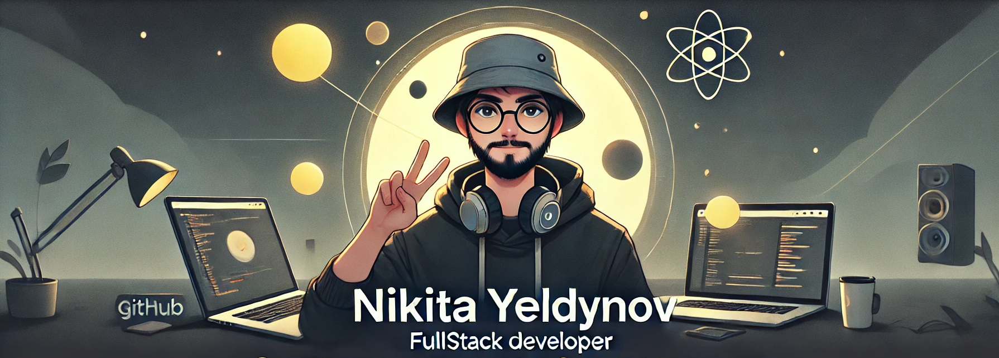

<!-- <h1 align="center"><a href="https://www.upwork.com/freelancers/~01666af90b1c137ab9" target="_blank" rel="noopener noreferrer"> Hey, I'm Nikita</a></strong> </h1> 
<h1 align="center"><b>Hi , I'm Nikita Yeldynov </b></h1>
-->

<!-- 

-->

## **Modern Fullstack Developer** crafting elegant, fast, and scalable solutions.

### 🛠️ What I Do

- Front-end: **React / Next.js + Tailwind CSS (shadcn/ui)**  
- Back-end: **Node.js + Express + PostgreSQL / MongoDB**  
- Strong with: **HTML**, **CSS**, **JavaScript**, **Bootstrap**, **MERN stack**, and more  
- Every project is **fast, pixel-perfect, and fully responsive**

---

### 💼 Freelancing & Open to New Opportunities

I'm currently freelancing on [Upwork](https://www.upwork.com/freelancers/~01666af90b1c137ab9), where I help clients build user-friendly, high-performance interfaces with clean code and great UX.

I'm always open to:
- Freelance & contract work  
- Long-term collaborations  
- Building digital products that make a difference  

---

### 🌱 How I Work

- 5+ years of experience  
- Detail-oriented & communication-focused  
- Daily commits → daily growth  
- Short, focused sprints with lo-fi in the background 🎧

---

### 📌 Links

<!-- - 💼 [Portfolio Website](https://yeldynov.tech/) -->
- 👨‍💻 [GitHub](https://github.com/yeldynov)
- 🧪 [Frontend Mentor Projects](https://www.frontendmentor.io/profile/yeldynov)
- 🧠 [Codewars Profile](https://www.codewars.com/users/yeldynov%20/)
- 📫 Contact: [yeldynovn@gmail.com](mailto:yeldynovn@gmail.com)
<!-- - 🤝 [Let’s Get in Touch](https://yeldynov.tech/contacts) -->

---

Thanks for stopping by — let’s build something great together!

<!-- 
  
 -->

<h3 align="left">Languages and Tools:</h3>

<!-- COUNTER -->
 
  

 <!--   -->
 
 

 

 <!--    -->

<!-- 

 -->

<!-- -->

